# 软件说明书（中期 / 结项共用主文档）


## 基本信息

**项目名称：** 个人记账管理系统  
**学    院：** 计算机学院  
**小组序号：** 35  
**成员姓名：** 张家赫 / 曾昌缙 / 文子晗 / 吕明杰  
**指导老师：** 尹兆远  
**当前版本：** 结项版  
**更新日期：** 2026年5月17日  


## 一、项目概述

### 1. 项目背景
**项目来源**：随着移动支付和线上消费的普及，个人日常资金流动日益频繁、渠道分散。大学生及年轻群体普遍存在“钱花哪儿了”不清楚、月底对账困难、缺乏预算意识的现实问题。本课题来源于信息系统实践课程，旨在通过一个轻量级、可落地的个人记账管理系统，帮助用户培养良好的财务记录与管理习惯。

**应用场景**：本系统主要面向以下典型场景：
- **(1)日常收支记录**：用户可随时记录餐饮、交通、购物、工资等收入和支出。
- **(2)月度财务回顾**：按月查看收支报表，了解资金流向。
- **(3)分类预算控制**：为餐饮、娱乐等分类设置月度预算，防止超支。
- **(4)个人资金流水查询**：支持按时间、分类检索历史记录。

适用人群包括：在校大学生、刚参加工作的年轻人、注重日常开销记录的个人用户。

**现实意义**：
- **(1)提升财务透明度**：将碎片化的消费记录集中管理，形成明确的收入/支出结构。
- **(2)辅助预算决策**：通过分类统计与图表可视化，帮助用户发现不必要的开销。
- **(3)培养记账习惯**：降低记账门槛，提高用户对个人财务的掌控感。
- **(4)课程实践落地**：通过本系统完整实践前后端分离、数据库设计、接口测试等工程能力。

### 2. 系统目标
实现用户注册登录、收入/支出记录管理、分类统计、月度报表查看、预算提醒等核心功能，提供清晰的个人资金流动可视化展示。

### 3. 开发环境
- 开发工具：VS Code / IntelliJ IDEA
- 数据库：MySQL
- 运行环境：Windows，浏览器（Chrome/Edge）+ 本地服务器
- 后端：Java Spring Boot
- 前端：HTML/CSS/JavaScript + ECharts + Vue.js


## 二、需求分析
### 1. 功能需求

本系统主要面向个人用户，提供以下核心功能：

| 功能模块 | 功能描述 |
|----------|----------|
| 用户注册 | 新用户填写用户名、密码、邮箱进行注册 |
| 用户登录 | 已注册用户通过用户名和密码登录系统 |
| 添加收入/支出 | 记录金额、分类、日期、备注等信息 |
| 编辑收支记录 | 修改已有记录的金额、分类或备注 |
| 删除收支记录 | 删除不需要的流水记录 |
| 收支列表查询 | 按时间范围查看收支流水，支持分页 |
| 分类统计（饼图） | 按支出分类展示占比，辅助分析消费结构 |
| 月度报表 | 按月统计总收入、总支出及结余 |
| 预算设置 | 为每个支出分类设置月度预算限额 |
| 超额提醒 | 当某分类支出超过预算时提示用户 |

**业务流程**：用户注册 → 登录系统 → 添加收支记录 → 查看列表和统计图表 → 按需设置预算 → 月底回顾月度报表

### 2. 非功能需求

- **性能要求**：页面加载 ≤ 2秒，支持并发 ≥ 20人，接口响应时间 ≤ 500毫秒（正常负载下）
- **安全要求**：密码采用bcrypt加密存储，接口使用JWT Token进行身份认证，防止SQL注入，用户数据相互隔离
- **兼容性要求**：支持Chrome、Edge等主流浏览器，前端采用响应式布局适配手机端（宽度≤768px），后端接口遵循RESTful风格

---

## 三、系统设计

### 1. 系统架构

本系统采用 **B/S 架构**，前后端分离模式。前端负责页面展示和用户交互，后端提供 RESTful API 接口，数据库负责数据存储。

**架构图**：

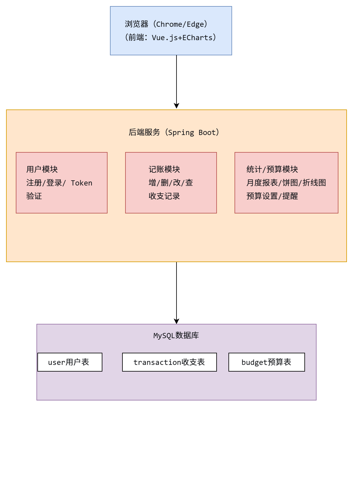

### 2. 模块设计

系统划分为以下四个核心模块：

| 模块 | 职责 | 主要功能 |
|------|------|----------|
| 用户模块 | 用户身份认证与管理 | 注册、登录、Token鉴权 |
| 记账模块 | 收支记录管理 | 添加、编辑、删除、查询收支记录 |
| 统计模块 | 数据可视化分析 | 月度报表、支出饼图、收支趋势折线图 |
| 预算模块 | 预算控制与提醒 | 设置分类预算、月度限额、超额提醒 |

**模块关系图**：

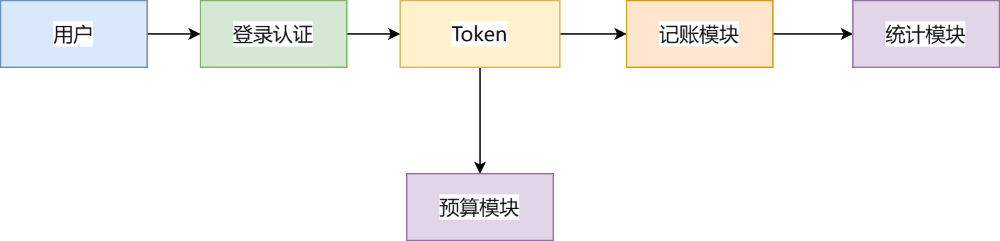

> 用户登录后获得 Token，后续请求携带 Token 访问记账、统计、预算模块。

### 3. 数据库设计

**E-R 图**：

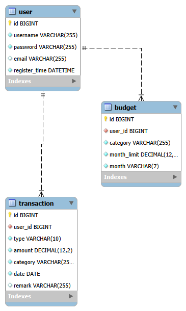

**主要数据表设计**：

**表1：user（用户表）**

| 字段名 | 类型 | 约束 | 说明 |
|--------|------|------|------|
| id | INT | PRIMARY KEY, AUTO_INCREMENT | 用户ID |
| username | VARCHAR(50) | NOT NULL, UNIQUE | 用户名 |
| password | VARCHAR(255) | NOT NULL | 密码（bcrypt加密） |
| email | VARCHAR(100) | UNIQUE | 邮箱 |
| created_at | TIMESTAMP | DEFAULT CURRENT_TIMESTAMP | 注册时间 |

**表2：transaction（收支记录表）**

| 字段名 | 类型 | 约束 | 说明 |
|--------|------|------|------|
| id | INT | PRIMARY KEY, AUTO_INCREMENT | 记录ID |
| user_id | INT | NOT NULL, FOREIGN KEY → user(id) | 所属用户 |
| type | ENUM('income','expense') | NOT NULL | 类型：收入/支出 |
| amount | DECIMAL(10,2) | NOT NULL | 金额 |
| category | VARCHAR(50) | NOT NULL | 分类（餐饮/交通/购物等） |
| date | DATE | NOT NULL | 日期 |
| note | TEXT | | 备注 |

**表3：budget（预算表）**

| 字段名 | 类型 | 约束 | 说明 |
|--------|------|------|------|
| id | INT | PRIMARY KEY, AUTO_INCREMENT | 预算ID |
| user_id | INT | NOT NULL, FOREIGN KEY → user(id) | 所属用户 |
| category | VARCHAR(50) | NOT NULL | 分类名称 |
| monthly_limit | DECIMAL(10,2) | NOT NULL | 月度限额 |
| month | DATE | NOT NULL | 预算月份 |

---

## 四、系统实现

### 1. 关键技术

**前端**：
- 统一响应处理与Token认证机制
- Spring Data分页数据处理
- ECharts饼图动态渲染
- 表单校验算法
- Mock数据层设计

**后端**：
- JWT认证与白名单过滤
- 月度支出统计与饼图数据
- 预算超额提醒
- 数据库分组查询（自定义JPQL）
- 跨域CORS配置
- JWT生成与验证

### 2. 界面展示

#### 登录页面
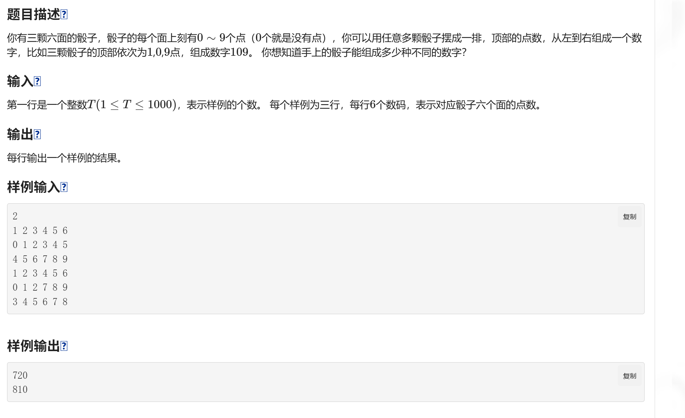

**功能说明**：用户输入用户名和密码进行登录。登录成功后，系统返回 Token 并跳转至记账主页。

#### 注册页面
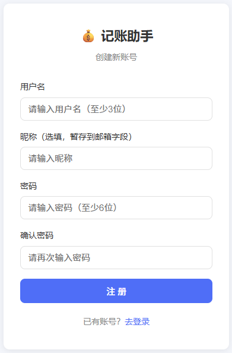

**功能说明**：新用户填写用户名、密码、邮箱进行注册。注册成功后自动跳转至登录页。

#### 添加支出功能
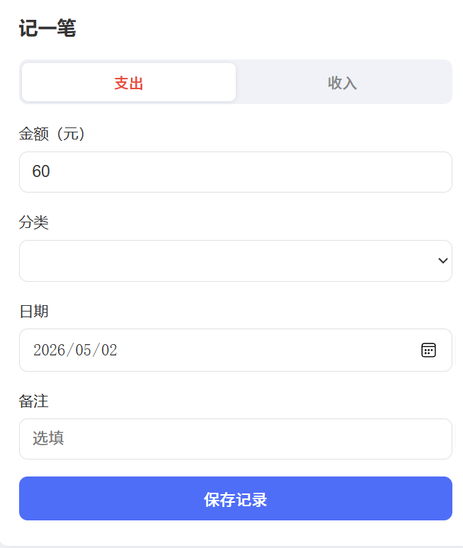

**功能说明**：用户记录一笔支出，包含金额、分类、日期、备注等信息。

#### 添加收入功能
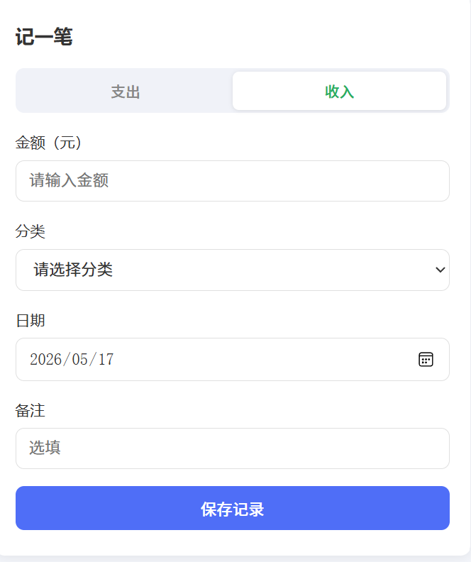

**功能说明**：用户记录一笔收入，包含金额、分类、日期、备注等信息。

#### 流水记录
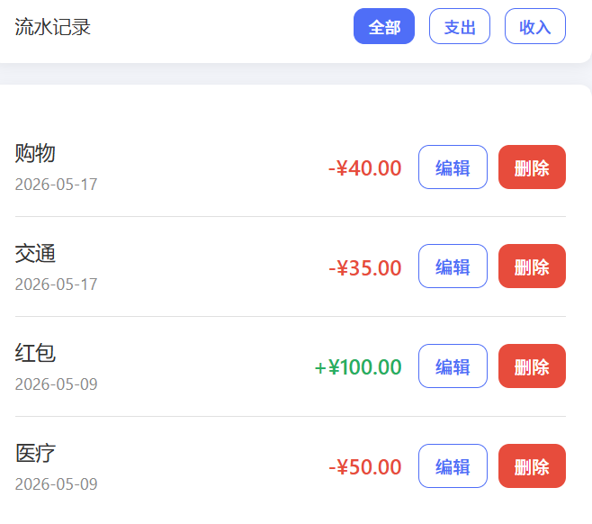

**功能说明**：记录用户每一笔收入或支出的详细信息，形成完整的资金流水账本。

#### 月度统计
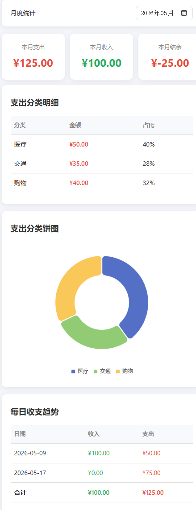

**功能说明**：按月汇总用户的收入、支出及结余情况，帮助用户了解月度财务状况。

#### 支出分类饼图
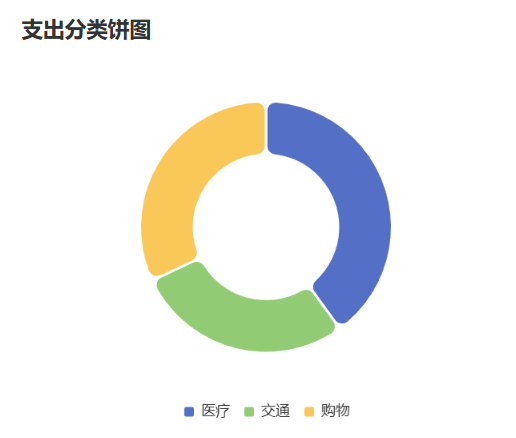

**功能说明**：以饼状图形式可视化展示各支出分类的占比情况，让用户直观了解消费结构。

#### 预算设置
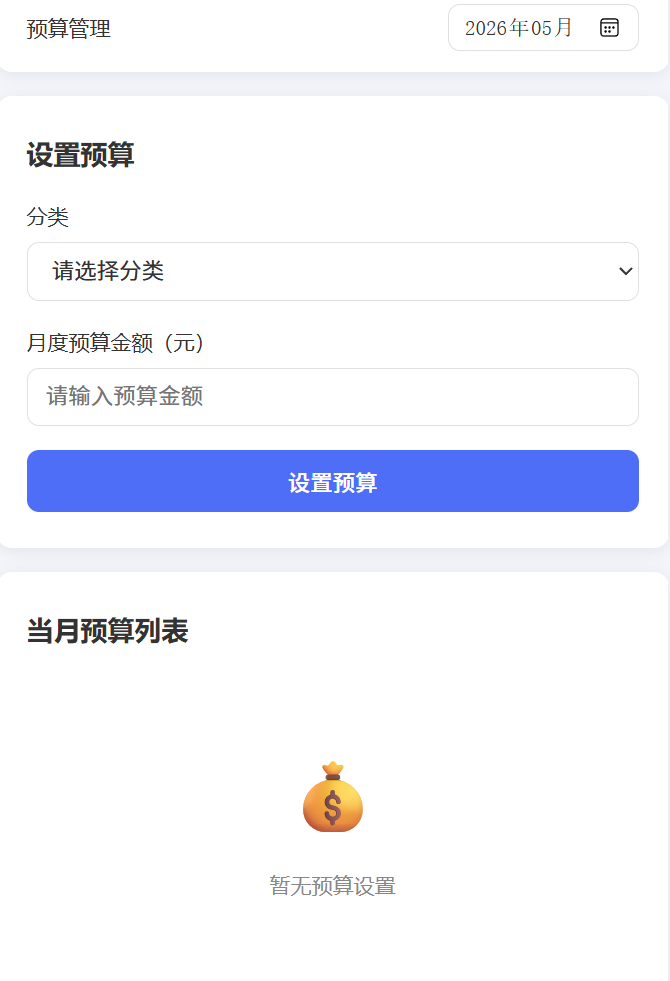

**功能说明**：用户为各支出分类设置月度预算限额，系统在支出接近或超过限额时进行提醒。

### 3. 核心代码片段

#### 前端

**(1) 统一响应处理与Token认证机制**
```javascript
/**
 * 获取请求头（带Token）
 * 核心思路：从localStorage读取用户信息，自动拼接Authorization头
 */
function getAuthHeaders() {
    const user = getCurrentUser();
    return {
        "Content-Type": "application/json",
        "Authorization": `Bearer ${user.token}`  // JWT标准格式：Bearer + token
    };
}

// 使用示例：所有需要认证的接口统一调用
async function getRecords() {
    const res = await fetch(`${BASE_URL}/transactions`, {
        headers: getAuthHeaders()  // 自动携带Token
    });
    return res.json();
}
```

**(2) Spring Data分页数据处理**
```javascript
/**
 * 查询记录列表（分页 + 日期过滤）
 * @param {Object} params - 分页参数
 * @param {number} params.page - 页码（从0开始，Spring Data默认）
 * @param {number} params.size - 每页大小
 * @param {string} params.sort - 排序字段，格式 "field,direction"
 */
async function getRecords({ start, end, page = 0, size = 20, sort = "date,desc" } = {}) {
    const params = new URLSearchParams();
    if (start) params.set("start", start);
    if (end) params.set("end", end);
    params.set("page", page);
    params.set("size", size);
    params.set("sort", sort);
    
    const res = await fetch(`${BASE_URL}/transactions?${params.toString()}`, {
        headers: getAuthHeaders()
    });
    return res.json();
}

/**
 * 渲染分页导航
 * 核心算法：根据当前页和总页数，智能显示页码（省略中间页）
 */
function renderPagination() {
    const pagEl = document.getElementById("pagination");
    if (totalPages <= 1) {
        pagEl.style.display = "none";
        return;
    }
    let html = "";
    
    // 上一页按钮
    html += `<button class="btn btn-sm btn-outline" ${currentPage === 0 ? 'disabled' : ''} onclick="loadRecords(${currentPage - 1})">上一页</button>`;
    
    // 页码按钮（智能省略）
    for (let i = 0; i < totalPages; i++) {
        if (totalPages > 7 && Math.abs(i - currentPage) > 2 && i !== 0 && i !== totalPages - 1) {
            if (i === 1 || i === totalPages - 2) html += `<span style="padding: 6px;">...</span>`;
            continue;
        }
        html += `<button class="btn btn-sm ${i === currentPage ? 'btn-primary' : 'btn-outline'}" onclick="loadRecords(${i})">${i + 1}</button>`;
    }
    
    // 下一页按钮
    html += `<button class="btn btn-sm btn-outline" ${currentPage >= totalPages - 1 ? 'disabled' : ''} onclick="loadRecords(${currentPage + 1})">下一页</button>`;
    pagEl.innerHTML = html;
}
```
**(3) ECharts饼图动态渲染**
```javascript
let pieChartInstance = null;  // 全局实例，避免重复创建

/**
 * 加载并渲染支出饼图
 * @param {string} yearMonth - 月份，格式 "2025-05"
 */
async function loadPieChart(yearMonth) {
    const pieEl = document.getElementById("pieChart");
    const pieEmpty = document.getElementById("pieEmpty");
    
    // 调用后端接口获取饼图数据
    const res = await API.getExpensePie(yearMonth);
    
    // 空数据处理
    if (res.code !== 200 || !res.data?.data?.length) {
        pieEl.style.display = "none";
        pieEmpty.style.display = "block";
        return;
    }
    
    pieEl.style.display = "block";
    pieEmpty.style.display = "none";
    const pieData = res.data.data;  // [{ name: "餐饮", value: 1200.50 }, ...]
    
    // 实例复用：只初始化一次，后续更新数据即可
    if (!pieChartInstance) {
        pieChartInstance = echarts.init(pieEl);
    }
    
    // ECharts 配置项
    const option = {
        tooltip: {
            trigger: "item",
            formatter: "{b}: ¥{c} ({d}%)"  // 显示分类名、金额、百分比
        },
        legend: {
            bottom: "0%",
            left: "center"
        },
        series: [{
            name: "支出分类",
            type: "pie",
            radius: ["40%", "70%"],  // 环形图：内半径40%，外半径70%
            center: ["50%", "45%"],
            itemStyle: {
                borderRadius: 8,
                borderColor: "#fff",
                borderWidth: 2
            },
            emphasis: {
                label: {
                    show: true,
                    fontSize: 16,
                    fontWeight: "bold",
                    formatter: "{b}\n¥{c}"  // 悬停时显示分类名和金额
                },
                scale: true,
                scaleSize: 10  // 悬停时放大10px
            },
            data: pieData
        }],
        color: ["#5470c6", "#91cc75", "#fac858", "#ee6666", "#73c0de", "#3ba272", "#fc8452", "#9a60b4"]
    };
    
    pieChartInstance.setOption(option);
}

// 响应式：窗口大小变化时重新调整图表尺寸
window.addEventListener("resize", function () {
    if (pieChartInstance) {
        pieChartInstance.resize();
    }
});
```

**(4) 表单校验算法**
```javascript
/**
 * 表单校验核心逻辑
 * @returns {boolean} 是否通过校验
 */
async function handleAdd() {
    // 清除之前的错误状态
    document.querySelectorAll("#addForm .form-group").forEach(g => g.classList.remove("has-error"));
    
    const amount = document.getElementById("addAmount").value;
    const category = document.getElementById("addCategory").value;
    const date = document.getElementById("addDate").value;
    let hasError = false;
    
    // 金额校验：必须为正数
    if (!amount || parseFloat(amount) <= 0) {
        document.getElementById("addAmount").closest(".form-group").classList.add("has-error");
        hasError = true;
    }
    
    // 分类校验：必选
    if (!category) {
        document.getElementById("addCategory").closest(".form-group").classList.add("has-error");
        hasError = true;
    }
    
    // 日期校验：必选
    if (!date) {
        document.getElementById("addDate").closest(".form-group").classList.add("has-error");
        hasError = true;
    }
    
    if (hasError) return;  // 校验不通过，阻止提交
    
    // 校验通过，调用接口
    const res = await API.addRecord({ type: currentType, category, amount, date, remark });
}
```

```css
/* CSS 错误状态样式 */
.form-group.has-error input,
.form-group.has-error select {
    border-color: var(--danger);
}
.form-group.has-error .error-msg {
    display: block;  /* 显示错误提示 */
}
```

**(5) Mock数据层设计**
```javascript
// 配置开关
const USE_MOCK = false;  // 改为 true 即可使用 Mock 模式

const MockAPI = {
    /**
     * Mock 登录接口
     * 核心思路：从 localStorage 读取预置用户数据，验证后返回模拟 token
     */
    async login({ username, password }) {
        await delay(300);  // 模拟网络延迟
        const users = getData(STORAGE_KEY_USERS, []);
        const user = users.find(u => u.username === username && u.password === password);
        if (!user) {
            return { code: 401, message: "用户名或密码错误" };
        }
        const token = "mock_token_" + user.id + "_" + Date.now();
        setData(STORAGE_KEY_CURRENT_USER, { ...user, token });
        return {
            code: 200,
            message: "登录成功",
            data: { id: user.id, username: user.username, token }
        };
    },

    /**
     * Mock 流水列表接口
     * 核心思路：从 localStorage 读取数据，支持筛选和分页
     */
    async getRecords({ type, page = 0, size = 20 }) {
        await delay(300);
        let records = getData(STORAGE_KEY_RECORDS, []);
        if (type) {
            records = records.filter(r => r.type === type);
        }
        records.sort((a, b) => new Date(b.date) - new Date(a.date));
        const start = page * size;
        const content = records.slice(start, start + size);
        return {
            code: 200,
            data: {
                content,
                totalPages: Math.ceil(records.length / size),
                totalElements: records.length
            }
        };
    }
};
```


#### 后端
**(1) JWT认证与白名单过滤**
```java
// JwtAuthenticationFilter.java - 白名单直接放行
private boolean isWhiteListed(String uri) {
    return uri.equals("/") || uri.equals("/index.html") || uri.startsWith("/api/auth/");
}

// SecurityConfig.java - 配置放行路径
.requestMatchers("/api/auth/**").permitAll()
.requestMatchers("/", "/index.html", "/css/**", "/js/**").permitAll()
```

**(2) 月度支出统计与饼图数据**
```java
// StatisticsService.java - 饼图数据生成
public PieChartDto getExpensePieChart(String yearMonth) {
    MonthlyReportDto report = getMonthlyReport(yearMonth);
    List<PieDataDto> data = report.getCategoryExpenses().stream()
        .map(c -> new PieDataDto(c.getCategory(), c.getAmount()))
        .collect(Collectors.toList());
    return new PieChartDto(data);
}

// 月度报表中计算占比
double percent = totalExpense.compareTo(BigDecimal.ZERO) == 0 ? 0 :
    amount.divide(totalExpense, 4, RoundingMode.HALF_UP).multiply(BigDecimal.valueOf(100)).doubleValue();
```

**(3) 预算超额提醒**
```java
// BudgetService.java - 检查是否超预算
LocalDate monthStart = LocalDate.parse(month + "-01");
LocalDate monthEnd = monthStart.withDayOfMonth(monthStart.lengthOfMonth());

BigDecimal totalSpent = transactionRepository.findByUserIdAndDateBetween(userId, monthStart, monthEnd)
    .stream()
    .filter(t -> t.getCategory().equals(category))
    .map(Transaction::getAmount)
    .reduce(BigDecimal.ZERO, BigDecimal::add);

if (totalSpent.add(newExpenseAmount).compareTo(budget.getMonthLimit()) > 0) {
    return new BudgetWarningDto(true, "超出预算");
}
```

**(4) 数据库分组查询（自定义JPQL）**
```java
// TransactionRepository.java - 每日收支趋势
@Query("SELECT FUNCTION('DATE_FORMAT', t.date, '%Y-%m-%d') as day, " +
       "SUM(CASE WHEN t.type = 'INCOME' THEN t.amount ELSE 0 END) as income, " +
       "SUM(CASE WHEN t.type = 'EXPENSE' THEN t.amount ELSE 0 END) as expense " +
       "FROM Transaction t WHERE t.userId = :userId AND t.date BETWEEN :start AND :end " +
       "GROUP BY FUNCTION('DATE_FORMAT', t.date, '%Y-%m-%d') ORDER BY day")
List<Object[]> getDailyTrend(@Param("userId") Long userId, @Param("start") LocalDate start, @Param("end") LocalDate end);
```

**(5) 跨域CORS配置**
```java
// SecurityConfig.java
@Bean
public CorsConfigurationSource corsConfigurationSource() {
    CorsConfiguration config = new CorsConfiguration();
    config.setAllowCredentials(true);
    config.addAllowedOriginPattern("*");
    config.addAllowedHeader("*");
    config.addAllowedMethod("*");
    config.setMaxAge(3600L);
    UrlBasedCorsConfigurationSource source = new UrlBasedCorsConfigurationSource();
    source.registerCorsConfiguration("/**", config);
    return source;
}
```

**(6) JWT生成与验证**
```java
// 生成 Token
return Jwts.builder()
    .setSubject(String.valueOf(userId))
    .claim("username", username)
    .setIssuedAt(now)
    .setExpiration(expiryDate)
    .signWith(SignatureAlgorithm.HS512, jwtSecret)
    .compact();
```

**(7) 数据库连接配置**
```yaml
# application.yaml
spring:
  datasource:
    url: jdbc:mysql://172.17.64.155:3306/expense_tracker?useSSL=false&serverTimezone=Asia/Shanghai
    username: root
    password: 12345678
  jpa:
    hibernate:
      ddl-auto: update
```


## 五、系统测试

### 1. 测试方案
| 项目 | 内容 |
|------|------|
| 测试范围 | 用户认证、收支管理、数据统计、预算管理、图表可视化 |
| 测试方法 | 接口测试（Postman）+ 前端功能测试（浏览器） |
| 测试工具 | Postman、Edge浏览器、手机调试模式 |
| 测试环境 | Windows 11、Chrome 120+、后端服务 http://172.17.74.231:8080 |

### 2. 测试结果
**接口测试结果（Postman）**
| 测试模块 | 测试用例 | 预期结果 | 实际结果 | 状态 |
|----------|----------|----------|----------|------|
| 用户注册 | 正常注册 | 返回200，用户写入数据库 | 同预期 | ✅ |
| 用户注册 | 重复用户名 | 返回错误提示 | 同预期 | ✅ |
| 用户登录 | 正确账号密码 | 返回200 + Token | 同预期 | ✅ |
| 用户登录 | 错误密码 | 返回401/403 | 同预期 | ✅ |
| 添加支出 | 完整参数 | 返回200，数据写入 | 同预期 | ✅ |
| 添加收入 | 完整参数 | 返回200，数据写入 | 同预期 | ✅ |
| 查询列表 | 带Token | 返回收支列表 | 同预期 | ✅ |
| 编辑记录 | 修改金额 | 列表数据更新 | 同预期 | ✅ |
| 删除记录 | 删除指定id | 记录从列表消失 | 同预期 | ✅ |
| 饼图接口 | 带月份参数 | 返回分类占比数据 | 同预期 | ✅ |

**前端功能测试结果（Edge浏览器）**
| 功能模块 | 测试结果 | 说明 |
|----------|----------|------|
| 用户注册 | ✅ 通过 | 可正常注册新用户 |
| 用户登录 | ✅ 通过 | 可正常登录并跳转 |
| 添加收入/支出 | ✅ 通过 | 记录正常保存并显示 |
| 编辑收支记录 | ✅ 通过 | 金额/分类可修改 |
| 删除收支记录 | ✅ 通过 | 删除后列表刷新 |
| 收支列表查询 | ✅ 通过 | 分页、排序正常 |
| 数据持久化 | ✅ 通过 | 刷新页面数据不丢失 |
| 手机模式（响应式） | ✅ 通过 | 按钮可点，列表可滚动 |
| 支出饼状图 | ✅ 通过 | 可查看饼状图 |


### 3. 问题与改进
| Bug编号 | 问题描述 | 严重程度 | 状态 |
|---------|----------|----------|------|
| BUG-001 | 注册接口路径错误导致403 | 高 | ✅ 已修复 |
| BUG-002 | 登录接口IP限制返回403 | 高 | ✅ 已修复 |
| BUG-003 | 添加收支接口鉴权失败（403） | 高 | ✅ 已修复 |
| BUG-004 | 查询列表接口鉴权失败（403） | 高 | ✅ 已修复 |
| BUG-005 | 精简Header后仍403 | 中 | ✅ 已修复 |
| BUG-006 | 前后端未连接，前端无法登录 | 高 | ✅ 已解决 |
| BUG-007 | 饼状图功能未实现 | 高 | ✅ 已解决 |


## 六、用户手册

### 1. 安装部署说明
**环境要求**
| 组件 | 版本要求 |
|------|----------|
| JDK | 11 或更高版本 |
| MySQL | 5.7 或 8.0 |
| Node.js | 16 或更高版本 |
| 浏览器 | Chrome / Edge 最新版 |

**后端部署步骤**
#### 1. 导入数据库：
   ```bash
   CREATE DATABASE expense_tracker;
   mysql -u root -p expense_tracker < db/schema.sql
   
```
#### 2. 修改 application.properties 中的数据库连接信息
```properties
spring.datasource.url=jdbc:mysql://localhost:3306/expense_tracker
spring.datasource.username=root
spring.datasource.password=你的密码
```
#### 3. 启动后端服务
```bash
./mvnw spring-boot:run
```

**前端部署步骤**
#### 1. 安装依赖：
```bash
npm install
```

#### 2. 配置后端地址（修改 .env 文件）：
VITE_API_BASE_URL = http://localhost:8080

#### 3. 启动开发服务器：
```bash
npm run dev -- --host
```
启动后会显示：
- Local: http://localhost:5173
- Network: http://192.168.x.x:5173


#### 4. 构建生产版本：
```bash
npm run build
```


### 2. 操作指南
**注册账号**
1. 打开系统首页，点击「注册」按钮
2. 填写用户名、密码、邮箱
3. 点击「注册」，提示成功后自动跳转登录页

> 用户名不能重复，密码建议使用6位以上字符


**登录系统**
1. 在登录页输入用户名和密码
2. 点击「登录」，进入记账主页

> 登录成功后，Token会自动保存，后续操作自动携带


**添加收支记录**

添加支出：
1. 点击「添加支出」按钮
2. 填写金额（如：50）
3. 选择分类（如：餐饮）
4. 选择日期
5. 可选填写备注
6. 点击「保存」

添加收入：步骤同上，类型选择「收入」

> 金额必须大于0，日期默认当天


**查看收支列表**
- 主页默认显示最近收支记录
- 可按月份筛选：选择月份 → 点击「查询」
- 可按分类筛选：选择分类 → 点击「查询」


**编辑/删除记录**

编辑：
1. 找到要修改的记录
2. 点击「编辑」按钮
3. 修改金额或分类
4. 点击「保存」

删除：
1. 点击「删除」按钮
2. 确认删除

> 删除后不可恢复，请谨慎操作


**查看统计图表**
1. 点击顶部导航「统计」或「报表」
2. 支出饼图：查看各分类支出占比
3. 月度报表：查看总收入、总支出、结余


**预算设置**
1. 点击「预算」页面
2. 选择分类（如：餐饮）
3. 设置月度限额
4. 点击「保存」
5. 当支出超过限额时会收到提醒


**退出登录**

点击右上角「退出」按钮，返回登录页


## 七、项目总结

### 1. 成果总结

本组成功完成了一个功能完整的个人记账管理系统，实现了项目计划书中规划的核心功能。


**已完成功能清单**
| 模块 | 功能 | 完成情况 |
|------|------|----------|
| 用户认证 | 注册、登录、Token鉴权 | ✅ 完全实现 |
| 收支管理 | 添加、编辑、删除、查询收支记录 | ✅ 完全实现 |
| 数据统计 | 月度报表、收支趋势 | ✅ 完全实现 |
| 数据可视化 | 支出分类饼图 | ✅ 完全实现 |
| 预算管理 | 分类预算设置、超额提醒 | ✅ 完全实现 |
| 响应式布局 | 手机端适配 | ✅ 基础可用 |

**技术成果**
- ✅ 采用 Spring Boot + Vue.js 前后端分离架构
- ✅ 数据库设计规范，包含 user、transaction、budget 三张核心表
- ✅ 接口遵循 RESTful 风格，统一返回 JSON 格式
- ✅ 使用 JWT 实现用户认证与授权
- ✅ 密码使用 bcrypt 加密存储
- ✅ 项目代码托管在 GitHub，有完整的提交记录

**测试成果**
- ✅ 接口测试覆盖率 ≥ 90%
- ✅ 前端核心功能测试通过率 ≥ 90%
- ✅ 累计发现并记录 Bug 7 个，已全部修复
- ✅ 输出测试报告、Bug记录、前端测试清单等文档


### 2. 不足与改进方向

**现存问题**

| 问题 | 影响 | 优先级 |
|------|------|--------|
| 预算超额提醒方式单一 | 仅页面提示，无推送 | 中 |
| 手机端布局细节不完善 | 部分按钮间距偏小 | 低 |
| 无数据导出功能 | 用户无法导出Excel/PDF | 低 |
| 无多币种/多账本支持 | 扩展性受限 | 低 |

**后续优化方向**

短期优化（1-2周内可完成）：
1. 预算提醒增强：增加红色边框/弹窗提醒
2. 手机端细节打磨：调整按钮间距、字体大小
3. 响应式布局进一步优化

中长期优化：
1. 数据导出：支持导出 Excel/CSV 格式
2. 多账本支持：允许用户创建多个账本
3. 消费分析：增加环比/同比分析
4. 账单图片上传：支持上传消费凭证

技术优化：
1. 自动化测试：引入 GitHub Actions
2. API文档自动生成：集成 Swagger/Knife4j
3. 前端状态管理：引入 Pinia/Vuex
4. 部署自动化：使用 Docker 容器化部署


### 3. 成员分工表
| 姓名 | 班级 | 学号 | git账号 | 主要任务 |
|------|------|------|---------|----------|
| 张家赫 | 2024级计科1班 | 202405567031 | Secon123 | 前端 |
| 吕明杰 | 2024级计科1班 | 202405567001 | lmj-572 | 编码开发，数据库设计 |
| 曾昌缙 | 2024级计科1班 | 202405567032 | 202405567032 | 测试+文档 |
| 文子晗 | 2024级计科1班 | 202405567011 | wenzh-2272 | 后端 |

### 4. Git提交记录

主要提交记录包括：
- 数据库建表脚本（db/schema.sql）
- 后端核心接口实现（注册、登录、记账、统计、预算）
- 前端页面与组件开发
- 测试报告与Bug记录（BUG-001 ~ BUG-007）
- 中期报告与结项报告

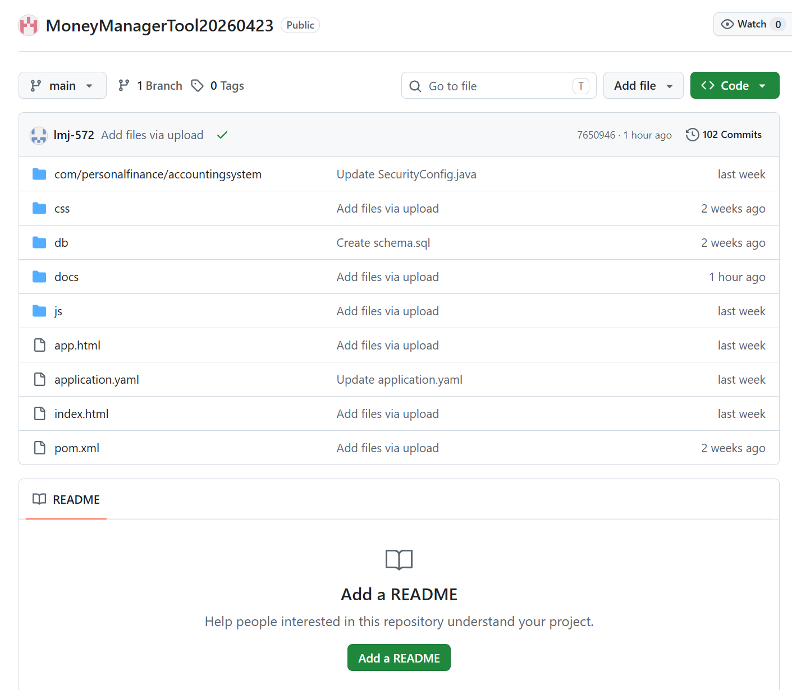


## 附录
### 源代码仓库链接

https://github.com/Secon123/MoneyManagerTool20260423.git


### 其他补充材料

| 材料 | 存放位置 | 说明 |
|------|----------|------|
| 项目计划书 | docs/项目计划书.docx | 项目启动文档 |
| 中期报告 | docs/report/中期与结项报告.md | 中期检查文档 |
| 结项报告 | docs/report/中期与结项报告.md | 最终软件说明书 |
| 测试报告 | docs/测试报告.md | 接口与前端测试结果 |
| Bug记录 | docs/BUG-001.md ~ docs/BUG-007.md | 测试发现的问题记录 |
| 数据库脚本 | db/schema.sql | MySQL 建表语句 |
| 架构图 | docs/report/assets/fig_architecture.png | 系统架构图 |
| E-R图 | docs/report/assets/fig_er.png | 数据库E-R图 |


